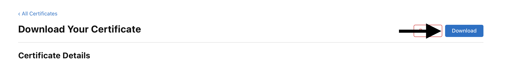

# Создание Push notification сертификата

Сначала переходим  и авторизируется на  https://developer.apple.com/account

Переходим в сертификаты


Дальше нажимаем на создание сертификата


В Service выбираем “****Apple Push Notification service SSL (Sandbox & Production)****”


Выбираем свой App ID


Следующим шагом на MacBook нужно открыть программу **Keychain Access**  и выбираем “**Request a Certificate From a Certificate Authority…**”


Заполняем все данные и выбираем куда сохранить на компьютере


В папке куда сохранили появится файл “CertificateSigningRequest.certSigningRequest”

Его мы загружаем в developer apple


После чего у нас создается сертификат мы переходим в него и скачиваем



После переходим в **Keychain Access** выбираем вкладку Login и после перекидываем файл, который скачали


Следующим шагом выбираем его в списке и нажимаем Export выбирая формат .p12

Прописываем пароль


У нас появится файл **Certificate.p12** в зависмости от того, как вы называли

Следующим шагом открываем **terminal** и вводим команду

```jsx
openssl pkcs12 -in Certificate.p12 -out prod.pem -nodes -clcerts
```

Подставляем ваши названия, которые нужны и получаем .pem файл