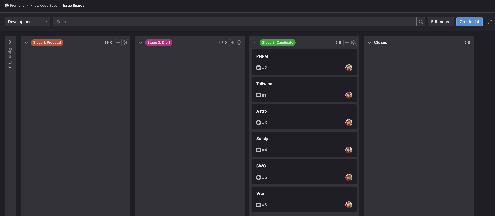
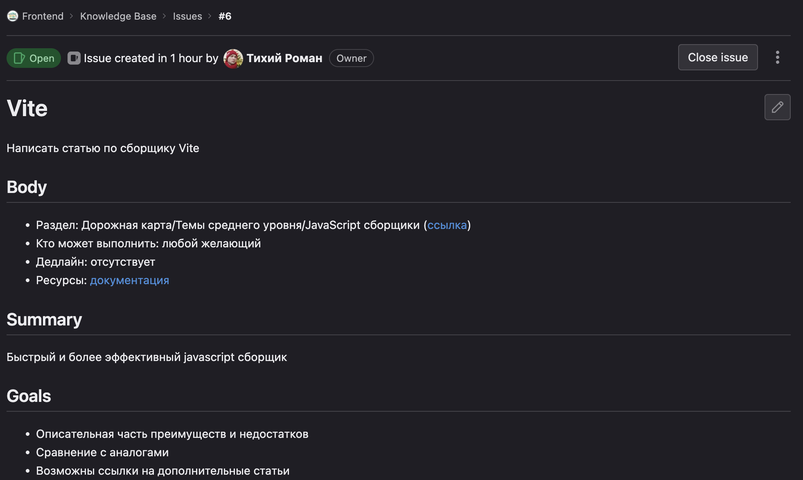
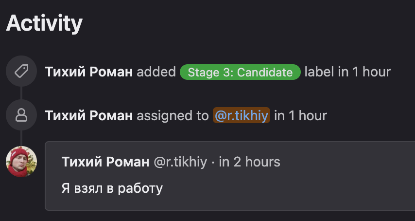

# Как написать статью?

База знаний фронтенд разработчика компании ZeBrains, была создана с помощью инструмента Vitepress ([документация](https://vitepress.dev/guide/what-is-vitepress)) - современного генератора статических сайтов, разработанного для создания документации и других подобных проектов.

Процесс написания новой статьи схож с написанием кода в вашей IDE. Перед началом, рекомендую ознакомиться с [документацией](https://www.markdownguide.org/basic-syntax/) по синтаксису markdown.

## Какую тему выбрать?

Перед началом, необходимо определиться, на какую тему вы будете писать статью, для этого, необходимо перейти на [доску](https://gitlab.zebrains.team/frontend/knowledge-base/-/boards) в гитлабе, где можно увидеть статьи, которые ожидают, чтобы их написали.



### Этапы
- Stage 1: Proposal - на этом этапе любой желающий может добавить черновую идею с предложением по изменению или добавлению статьи
- Stage 2: Draft - этот этап включает в себя принятые предложения, требующие выполнения, но еще не имеющие должного описания
- Stage 3: Candidate - на этом этапе находятся задачи, которые можно взять на работу, если нет особенных требований



## Определился с темой

Если тема была выбрана, необходимо написать это в комментариях к задаче (там же, можно обсудить уточняющие детали, задать дополнительные вопросы)



## Развертывание проекта

Сначала клонируем репозиторий

```sh
git clone https://gitlab.zebrains.team/frontend/knowledge-base.git
```

Устанавливаем и запускаем dev окружение

::: code-group

```sh [pnpm]
pnpm install
pnpm run docs:dev
```

```sh [npm]
npm install
npm run docs:dev
```

```sh [yarn]
yarn install
yarn run docs:dev
```

:::

1. Создаем ветку `{имя ряздела}-{номер задачи}` (пример `roadmap-1`)

2. После, создаем `md` файл в соответствующем иерархии каталоге `docs`. Название файла не принципиально, можно одним или двумя словами слитно о сути статьи

3. В корне каждого раздела лежит `config.js` файл, содержащий иерархию отображаемого бокового меню, необходимо создать новый объект который будет содержать заголовок `text` и ссылку до создаваемого файла `link`

**Пример:**

```json5
{
  text: 'Дорожная карта',
  link: '/roadmap/',
  collapsed: true, // По умолчанию должен ли быть раскрыт или закрыт раздел
  items: [] // Вложенные страницы
}
```

4. в каталоге .vitepress лежит `config.js`, в который можно добавлять пункт меню в сайдбар

По завершению статьи, делаем merge request, устраняем недочеты, если они имеются.

Статья готова! Вы внесли свой вклад в наполнение базы знаний.
