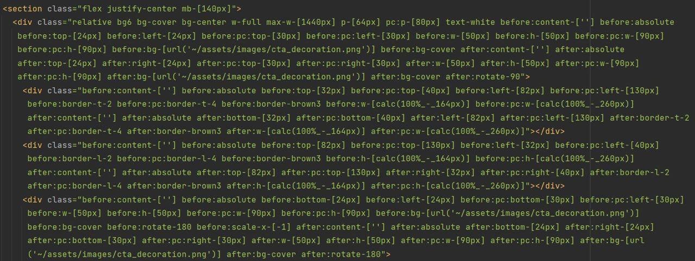
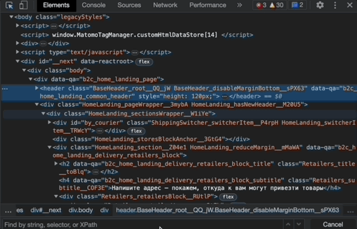

# Tailwindcss

Tailwind – это популярный утилитарный CSS-фреймворк, предлагающий обширный набор классов для ускорения процесса разработки и облегчения поддержки кода. Вместо традиционного подхода с использованием одного класса, содержащего в себе набор свойств, Tailwind предоставляет классы, содержащие в себе одно конкретное свойство (за некоторыми исключениями). Подход к стилизации элементов с Tailwind напоминает Bootstrap, но в отличие от Bootstrap, готовых компонентов он не предоставляет. Tailwind по замыслу разработчиков предоставляет большой набор интуитивно понятных классов, префиксов и суффиксов, которые должны быть просты для чтения и восприятия. Основная идея Tailwind заключается в возможности написания стилей в сокращенном синтаксисе прямо внутри компонента, что должно повышать производительность и ускорять разработку.

### Основные достоинства:

- Прост в освоении, легок в настройке и присутствует возможность переопределения как базовых свойств, так и расширения и добавления новых уникальных. Тем не менее без уверенных знаний css, эффективно работать с препроцессором вряд ли выйдет. Хотя Tailwind и легок в своих идеях и освоении, понадобится достаточно большое количество времени, чтобы просто понять все возможности предоставляемые фреймворком, для того чтобы выстроить системный подход к работе со стилизацией. С этой проблемой может помочь официальное расширение для IDE, созданное командой Tailwind – IntelliSense. Оно предлагает набор решений, значительно облегчающих работу с фреймворком, например: автодополнение, линтинг, подсветка синтаксиса.

- Содержит большое количество готовых классов, что должно позволять легко и быстро изменять внешний вид элементов. В том числе наличие классов, содержащих медиазапросы, позволяющих создавать адаптивные интерфейсы, что дает возможность изменять стили в зависимости от размера экрана устройства. А также классы для псевдоэлементов и для управления состоянием при наведении, фокусировке, на активном элементе.

```html
// Пример - текст кнопки увеличивается на экранах с шириной свыше 768px (префикс md). Также присутствует псевдоэлемент before и состояния при наведении, нажатии и фокусировке.
    <button type="button" className="w-full p-2 text-base before:content-['before_content'] md:text-lg border-yellow-400 bg-slate-50 border-2 rounded-lg text-green-800 font-semibold transition-all duration-150 active:bg-slate-100 hover:animate-pulse focus:animate-pulse outline-green-800">
        Content
    </button>
```

- Интеграция с PurgeCSS, который позволяет удалить неиспользованные классы, что благотворно сказывается на оптимизации проекта, уменьшая размер файла.

- Отличная совместимость со всеми популярными фреймворками.

- Отсутствие необходимости долго размышлять и тратить время на выдумывание названий классов, особенно когда они должны содержать в себе всего пару свойств. На изобретение наименований в таких случаях может уходить больше времени, чем на саму стилизацию.

```html
// Условный пример c демонстрацией возможных трудностей придумывания наименований для классов.
    <div className="sectionFormItem">
        <div className="sectionFormItemWrapper">
            <div className="sectionFormItemWrapperWrapper">
                Content
            </div>
        </div>
    </div>
```

- Простота и скорость – с Tailwind можно быстро стилизовать компонент, сразу же на месте, не затрачивая время на создание отдельного модуля и переключения в него для написания стилей.

```html
// Стилизация с Tailwind.
// Component.jsx
    <div className="bg-white p-5 border-2 rounded-b-xl">
       Content
    </div>

// Классический подход к стилизации.
// Component.jsx
    <div className={style.content}>
       Content
    </div>

// Component.module.scss
    .content {
        padding: 1.25rem;
        background-color: #ffffff;
        border-width: 2px;
        border-bottom-right-radius: 0.75rem;
        border-bottom-left-radius: 0.75rem
    }
```

- Использование Tailwind напоминает inline стилизацию, но читабельность ощутимо выше. К тому же так как это именно классы, а не inline стили, специфичность стилей не повышается.

- Возможность создавать в отдельном файле кастомные классы из набора Tailwind классов, применяя их с помощью директивы @apply, что позволяет добиться при необходимости переиспользуемости классов, а также повысить читабельность компонента. Сами разработчики Tailwind советуют избегать этой директивы и подобного подхода, так как это в какой-то степени противоречит концепции Tailwind, гласящей “быстрое создание современных веб-сайтов, не покидая HTML-код”. Хотя при этом разработчики согласны с тем, что заваленный пачкой классов компонент тяжел для восприятия и выглядит неэстетично.

```html
// Пример создания класса с использованием директивы @apply.
// Component.jsx
    <button type="button" className={styles.button}>
        Content
    </button>

// Component.module.scss
.button {
     @apply w-full p-2 text-base before:content-['before_content'] md:text-lg border-yellow-400 bg-slate-50 border-2 rounded-lg text-green-800 font-semibold transition-all duration-150 active:bg-slate-100 hover:animate-pulse focus:animate-pulse outline-green-800;
}
```

- Также есть возможность написания кастомных значений в tailwind классы прямо внутри компонента

```html
// Component.jsx
    <div className="w-[100px] p-[10px] border-[20px]  bg-[#059669] text-[#6b4388]">
       Content
    </div>
```

- Существует возможность изменения базовых стилей html элементов с помощью слоя base. Например, можно изменить размер заголовков или добавить отступы абзацам

```html
// Пример изменения стилей заголовка и абзаца с помощью слоя base.
// Component.module.scss
@layer base {
  h1 {
    @apply text-2xl;
  }
  p {
    @apply mb-3;
  }
}
```

- Для переиспользуемости в проекте возможно создание собственных классов с помощью слоя components

```html
// Пример создания класса с помощью слоя components.
// Component.jsx
<div class="card">Content</div>

// Component.module.scss
@layer components {
    .card {
       @apply bg-red-400 font-serif font-bold text-3xl p-5 m-5 rounded-md text-center;
    }
  }
```

- Можно добавлять простые классы на основе утилит с помощью слоя utilits.

```html
// Пример scroll-snap классов для поведения скролла контейнера при прокрутке его содержимого.
// Component.module.scss
@layer utilities {
  .scroll-snap-none {
    scroll-snap-type: none;
  }
  .scroll-snap-x {
    scroll-snap-type: x;
  }
  .scroll-snap-y {
    scroll-snap-type: y;
  }
}
```

- В Tailwind существует возможность переопределения и расширения базовых tailwind классов в tailwind.config.js, что позволяет использовать кастомные значения глобально во всем приложении

```html
// tailwind.config.js
const plugin = require('tailwindcss/plugin');

module.exports = {
  content: [
    "./src/**/*.{js,jsx,ts,tsx}",
  ],
  theme: {
    extend: {
      colors: {
        "custom-yellow": {
          "500": "#AD910B",
          "400": '#BAA333',
          "300": '#C8B55C',
      },
      },
      fontFamily: {
        'comicSans': ['Comic Sans', 'sans-serif'],
      },
      fontWeight: {
        'ultraThin': '100',
      },
      padding: {
        '140': '35rem'
      }
    },
  },
  plugins: [
    plugin(function({ addVariant }) {
        addVariant('currentActive', '&.active');
    })
],
  variants: {
    extend: {
      backgroundColor: ['active'],
      textColor: ['visited'],
    }
  },
}

```

- Хорошо подходит для небольших проектов, где отсутствует строгий кастомный pixel-perfect дизайн. С Tailwind можно создать proof of concept, лендинг, небольшой pet-проект, где на первом месте стоит скорость разработки.


### Потенциальные недостатки

- Слишком большое количество классов, многие из которых скорее всего не будут использоваться. 

- Несмотря на обилие классов, если оставаться в рамках базовых, приложения, написанные на Tailwind, будут довольно сильно похожи друг на друга.

- Написание стилей внутри компонента, что может сильно его раздувать, негативно сказываясь на читабельности.

- Из-за обилия классов, довольно часто они бывают неинтуитивны и трудны для запоминания (например нам требуется css свойство align-items: center, попытка интуитивно использовать align:center не приведет к желаемому результату, придется обращаться к документации, чтобы узнать, что требуемое нам свойство записывается как items-center, а класс align в Tailwind отвечает за vertical-align. Или что за свойство display:none отвечает класс hidden). Для эффективной работы придется тщательно изучить доступные возможности.

- Плохо подойдет для масштабных проектов со сложным pixel-perfect дизайном и адаптивностью под различные размеры экрана. Стандартных классов с базовыми значениями будет недостаточно, их придется расширять большим количеством кастомных. В результате чего ухудшится читабельность компонента из-за раздутого количества классов на элементах.



- Отсутствие уникальных названий классов, что приводит к сложностям при работе с DevTools в проекте с использованием Tailwind. В попытках найти искомый элемент в дереве разработчик вместо нормального названия класса обнаружит неинформативный набор Tailwind классов и потратит лишнее время в поисках требуемого элемента. Разработчики на Tailwind для борьбы с этим предлагают задавать элементам информативные data-атрибуты. Хотя это и противоречит одной из идей фреймворка – “не нужно долго размышлять и выдумывать названия классов”, а в данном случае придется - для data-атрибутов, что нивелирует одно из преимуществ.




### Заключение

Tailwind точно не является обязательным инструментом, скорее весьма опциональным подспорьем в стилизации. В небольших проектах без каких-либо строгих требований к дизайну, он действительно может стать отличным помощником, существенно повысив производительность и сократив время разработки. В проектах покрупнее его применение сомнительно из-за ухудшения читабельности и поддержки, в результате чего в попытках побороть возникшие проблемы, преимущества и идеи фреймворка просто сходят на нет. Поэтому очень важно перед стартом проекта взвезить все плюсы и минусы, тщательно оценив все риски использования Tailwind.


* [Документация](https://tailwindcss.com/docs/installation)
* [Статья хабр](https://habr.com/ru/post/508844/)
* [Митап](https://hc.zebrains.team/f/43935)
