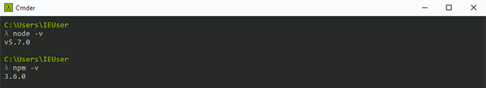

# Node.js и NPM

## Node.js

Node.js представляет среду выполнения кода на JavaScript, которая построена на основе движка JavaScript Chrome V8, который позволяет транслировать вызовы на языке JavaScript в машинный код. Node.js прежде всего предназначен для создания серверных приложений на языке JavaScript. Хотя также существуют проекты по написанию десктопных приложений (Electron) и даже по созданию кода для микроконтроллеров. Но прежде всего мы говорим о Node.js, как о платформе для создания веб-приложений.

Понимание того, что такое Node.js поможет вам лучше разобраться с npm. В двух словах — Node.js это интерпретатор языка JavaScript. Сам по себе Node.js является C++ приложением, которое получает на входе JavaScript-код и выполняет его.

### Что такое npm?

npm (Node Package Manager) – дефолтный пакетный менеджер для JavaScript, работающий на Node.js. Менеджер npm состоит из двух частей:

- CLI (интерфейс командной строки) – средство для размещения и скачивания пакетов,
- [онлайн-репозитории](https://www.npmjs.com/), содержащие JS пакеты.

Структуру репозитория [npmjs.com](https://npmjs.com/) можно представить, как центр исполнения заказов, который получает товары (npm-пакеты) от продавцов (авторы пакетов) и распространяет эти товары среди покупателей (пользователи пакетов).

### Package.json

Каждый проект в JavaScript – будь то Node.js или веб-приложение – может быть скопирован как npm-пакет с собственным описанием и файлом `package.json`.

`package.json` можно представить, как стикеры (список пакетов нужных версий) на npm-коробке (проект). Файл генерируется командой `npm init` при создании JavaScript/Node.js проекта со следующими метаданными:

- `name`: название JS библиотеки/проекта.
- `version`: версия проекта.
- `description`: описание проекта.
- `license`: лицензия проекта.

В `package.json` включено поле `scripts` для автоматизации сборки, например:

```java
{
  "scripts": {
    "build": "tsc",
    "format": "prettier --write **/*.ts",
    "format-check": "prettier --check **/*.ts",
    "lint": "eslint src/**/*.ts",
    "pack": "ncc build",
    "test": "jest",
    "all": "npm run build && npm run format && npm run lint && npm run pack && npm test"
  }
}
```

`eslint`, `prettier`, `ncc`, `jest` могут быть установлены глобально или локально для проекта внутри `node_modules/.bin/`.

### dependencies и devDependencies

`dependencies` и `devdependencies` представляют собой словари с именами npm-библиотек (ключ) и их [семантические версии](https://semver.org/lang/ru/) (значение). Пример из шаблона [TypeScript Action](https://github.com/actions/typescript-action):

```java
{
    "dependencies": {
      "@actions/core": "^1.2.3",
      "@actions/github": "^2.1.1"
    },
    "devDependencies": {
      "@types/jest": "^25.1.4",
      "@types/node": "^13.9.0",
      "@typescript-eslint/parser": "^2.22.0",
      "@zeit/ncc": "^0.21.1",
      "eslint": "^6.8.0",
      "eslint-plugin-github": "^3.4.1",
      "eslint-plugin-jest": "^23.8.2",
      "jest": "^25.1.0",
      "jest-circus": "^25.1.0",
      "js-yaml": "^3.13.1",
      "prettier": "^1.19.1",
      "ts-jest": "^25.2.1",
      "typescript": "^3.8.3"
    }
}
```

### Установка пакетов

Так как пользователи чаще скачивают пакеты , хорошо бы разобраться, как их устанавливать.

На текущий момент наиболее распространены менеджера установки пакетов:

- [NPM](https://docs.npmjs.com/getting-started) (в примерах будем использовать его)
- [Yarn](https://classic.yarnpkg.com/en/docs/getting-started)
- [pnpm](https://pnpm.js.org/)

`npm install` – команда, устанавливающая пакеты.

По умолчанию `npm install <package-name>` со знаком `^` установит последнюю версию пакета. `npm install` скачает пакет в папку проекта `node_modules` в соответствии с конфигурацией в файле `package.json`, обновив версию пакета везде, где это возможно (и, в свою очередь, обновив `package-lock.json`). При необходимости установки пакета глобально можно указать флаг `-g` .

Из документации [https://docs.npmjs.com/cli/install](https://docs.npmjs.com/cli/install) :

- `P`, `-save-prod`: опять же сохранит в "dependencies": { }. Это ваш код для продакшена, он будет включен в ваш конечный продукт. Добавляйте сюда только те библиотеки, которые будут использованы при работе вашего конечного продукта (вэб страницы например).
- `D`, `-save-dev`: сохранит пакет в "devDependencies": { }. Это пакеты, которые вы используете в процессе девелопмента, препроцессоры LESS, SASS, валидаторы кода, JShint Slint, препроцессоры JS: Babel. Эти пакеты не будут включены в конечный продукт.
- `O`, `-save-optional`: пакет будет добавлен в "optionalDependencies": { }. эти пакеты могут быть использованы в работе, но если они будут недоступны или произойдет ошибка при их установке, то npm просто пропустит их и продолжит работу.
- `-no-save`: Запрещает сохранять пакет в package.json.

### Установка Node.js и NPM

Необходимо перейти на официальный сайт [https://nodejs.org](https://nodejs.org/en/) и на главной странице скачать последнюю стабильную версию.

После загрузки инсталлятор следует запустить и установить Node.js, как любую другую программу.

Убедимся, что всё установилось. Для этого в cmder проверим версию Node.js с помощью команды:

```powershell
 node -v
```

Далее можно проверить версию NPM установленную вместе с Node.js

```powershell
 npm -v
```

С помощью этих команд мы увидим установленные версии node.js и npm



### Управление версиями Node.js

Наиболее простым способом устанавливать и переключать версии Node.js на Linux является использование утилиты nvm. Для разработчиков, которые «сидят» на Windows, существует порт этой утилиты, хотя и менее продвинутый. Разбираемся в управлении версиями Node.js через консоль в Windows.

### Что такое nvm?

[nvm](https://github.com/creationix/nvm) (Node Version Manager) — это довольно простой скрипт, который позволяет устанавливать, переключать и удалять версии Node.js на лету. Проще говоря, nvm даёт вам возможность держать на одной машине любое количество версий Node.js. При установке новой версии для неё создаётся отдельная директория, например, 5.0.0 или 4.2.2. При переключении версий скрипт подменяет путь до Node.js в PATH.

При этом нужно помнить, что глобальные пакеты для каждой версии свои и никак не пересекаются. Это значит, что если вы глобально установили пакет, используя Node.js версии *4.2.2* и переключились на версию *5.1.0*, то этот же пакет вам придётся устанавливать повторно уже для этой версии.

### Установка nvm для windows

Для этого вам придётся перейти в репозиторий [nvm-windows](https://github.com/coreybutler/nvm-windows) и загрузить установочный пакет. Далее процедура полностью стандартна, как и для любого другого установочного файла в Windows

### Установка nvm для linux (ubuntu like)

Сначала установим менеджер:

```bash
wget -qO- https://raw.githubusercontent.com/creationix/nvm/v0.33.8/install.sh | bash
```

Обновим среду оболочки, для чего требуется закрыть и снова открыть терминал, либо выполнить команду:

```bash
source ~/.profile
```

Проверяем:

```bash
nvm --version
```

### Управление версиями node.js

Получить список всех доступных версий node.js можно следующим образом:

```bash
nvm ls-remote
```

Теперь можно выбрать желаемый вариант и установить, например:

```bash
nvm install 10.15.3
```

Переключить на другую версию:

```bash
 nvm use <version_number>
```
