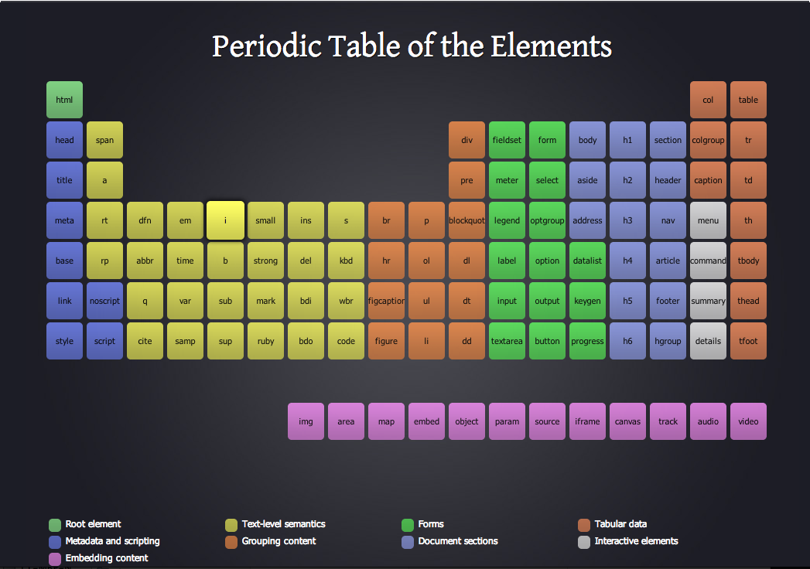
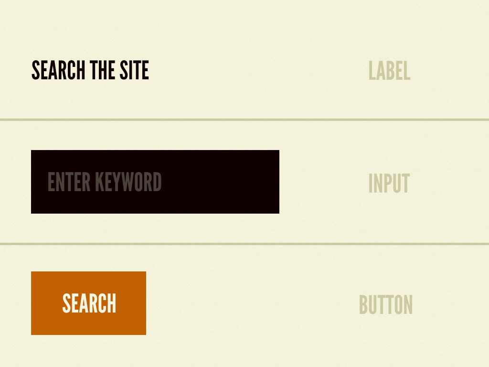
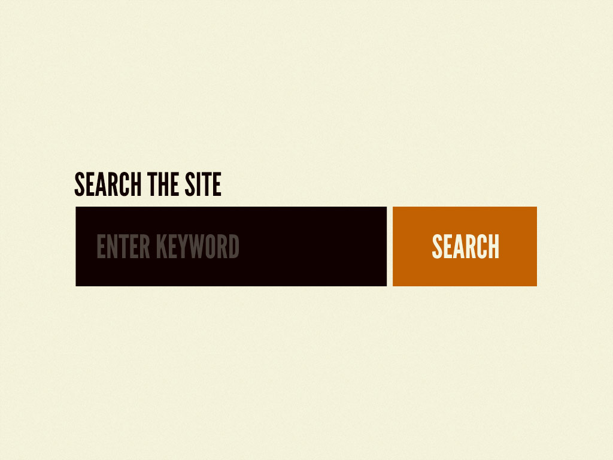
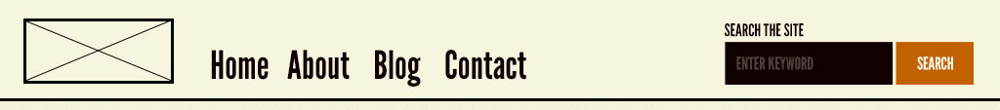
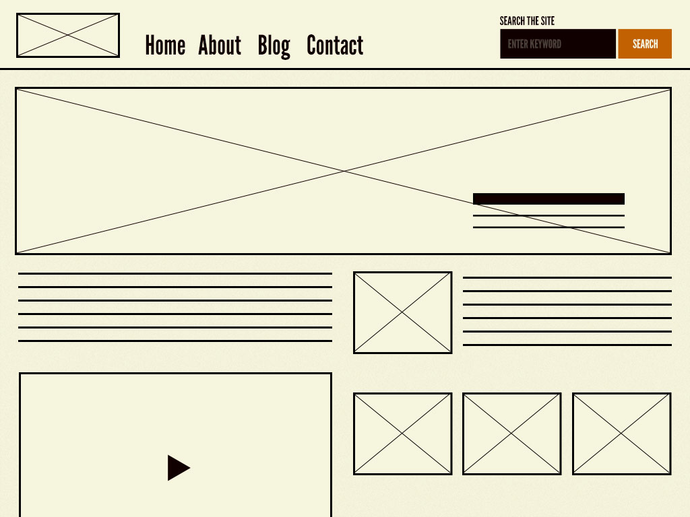

# Архитектура фронтенда: Atomic design

Концепция атомарного дизайна отличается от других подходов тем, что в приоритет ставится не простота восприятия и проектирования, что часто приводит к множеству проблем, а продуманность каждого аспекта архитектурного дизайна. Данный подход более сложен к восприятию, чем, например, [FSD(Feature Sliced Design)](fsd), который имеет принципиально противоположный подход.

Источником вдохновения для создания исследуемого подхода является химия. Идея заключается в том, что вся материя (будь то твердая, жидкая, газообразная, простая, сложная и т.д.) состоит из атомов. Эти атомные единицы соединяются вместе, образуя молекулы, которые, в свою очередь, объединяются в более сложные организмы, чтобы в конечном счете создать всю материю в нашей вселенной.

Аналогично, интерфейсы состоят из более мелких компонентов. Это означает, что мы можем разбить целые интерфейсы на фундаментальные строительные блоки и работать дальше. Это основная суть атомного дизайна.

## Мотивация к использованию

Атомарный дизайн обеспечивает четкую методологию для создания систем проектирования. Клиенты и члены команды могут лучше оценить концепцию систем проектирования, фактически увидев этапы, изложенные перед ними.

Атомарный дизайн дает нам возможность переходить от абстрактного к конкретному. Благодаря этому мы можем создавать системы, которые способствуют согласованности и масштабируемости, одновременно показывая вещи в их окончательном контексте. И, собирая, а не разбирая, мы создаем систему прямо с порога, вместо того чтобы выбирать шаблоны постфактум.

Атомарный дизайн разделяет структуру проекта на следующие элементы:

1. Атомы(Atoms)
2. Молекулы(Molecules)
3. Организмы(Organisms)
4. Шаблоны(Templates)
5. Страницы(Pages)

Каждый последующий элемент в списке является родительским по отношению к предыдущему. То есть каждая молекула состоит из атомов, каждый организм состоит из молекул, и тд. Иллюстрация подхода:

Чтобы лучше понять принцип построения приложений на основе данной архитектуры взглянем подробнее на каждую из сущностей.

### Атомы

Атомы - это основные строительные блоки материи. Применительно к веб-интерфейсам атомы - это компоненты, из которых строятся интерфейсы, такие как **кнопка**, **выпадающий список**, **поле ввода**, и т.п.

Атомы являются максимально абстрактными, и должны проектироваться с учетом высокой степени универсальности.

Атомы также могут включать в себя элементы, такие как цветовые палитры, шрифты и даже более невидимые аспекты интерфейса, такие как анимация.

### Молекулы

Молекулами называются компоненты, которые объединяют несколько атомов. Обычно такие компоненты имеют высокую степень абстрактности, и проектируются с возможностью переиспользования на разных страницах.

Примером молеулы может являться форма поиска, которая включает в себя **поле ввода**, **лейбл**, и **кнопку** подтверждения.

### Организмы

Из молекул и атомов составляются более крупные блоки, называемые организмами. Это могут быть отдельные секции страницы, как например хедер, футер, и тд.

Рассмотрим пример из документации по atomic design:

Здесь мы можем видеть 2 молекулы: форму поиска и навигационные ссылки, а также 1 атом - логотип.

Наращивание от молекул до организмов способствует созданию автономных, портативных, многоразовых компонентов.

### Шаблоны

На этапе создания шаблона нарушается химическая аналогия. Каждый шаблон представляет из себя совокупность организмов, и имеет интерфейсы для подключения конкретного контента.

Шаблоны очень конкретны и обеспечивают контекст для всех этих относительно абстрактных молекул и организмов.

Пример шаблона:

### Страницы

Страницы являются более частным случаем шаблонов, именно здесь целевой контент с помощью интерфейсов шаблонов попадает на страницу и приложение становится готовым к продакшну.

Этап создания страницы очень важен, поскольку именно на нем мы проверяем эффективность системы проектирования. Просмотр всего в контексте позволяет нам вернуться назад, чтобы модифицировать наши молекулы, организмы и шаблоны, чтобы лучше соответствовать реальному контексту дизайна.

Страницы также являются местом для тестирования вариантов шаблонов. Например, вы можете захотеть четко сформулировать, как выглядит заголовок, содержащий 40 символов, но также продемонстрировать, как выглядят 340 символов. Как это выглядит, когда у пользователя есть один товар в корзине покупок против 10 товаров с примененным кодом скидки? Опять же, эти конкретные случаи влияют на то, как мы возвращаемся к циклу и строим нашу систему.

Более подробно с концепцией атомарного дизайна на английском языке можно ознакомиться здесь: [https://bradfrost.com/blog/post/atomic-web-design/](https://bradfrost.com/blog/post/atomic-web-design/)
