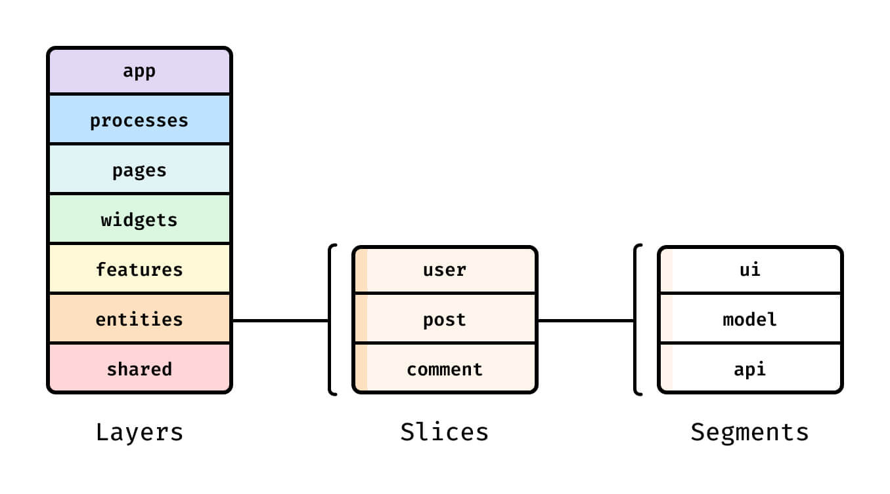

# Архитектура фронтенда: Feature sliced design

**Feature-Sliced Design** (FSD) — это архитектурная методология для проектирования frontend-приложений. Проще говоря, это свод правил и соглашений по организации кода. Главная цель методологии — сделать проект понятным и структурированным, особенно в условиях регулярного изменения требований бизнеса.

Преимуществами данного подхода являются:

- **Единообразие**
- **Контролируемое переиспользование логики**
- **Устойчивость к изменениям и рефакторингу**
- **Ориентированность на потребности бизнеса и пользователей**

FSD подходит для проектов и команд любого размера с некоторыми оговорками:

- Эта методология исключительно для фронтенда.
- Если вы разрабатываете очень простое приложение из одной странички на FSD, преимущества методологии вряд ли понадобятся, а вот разработка может замедлиться. Однако, FSD помогает стандартизированно мыслить о фронтенд-приложениях, так что смело используйте даже на маленьких проектах, если знаете, для чего она вам.
- Огромное приложение, соизмеримое с админ-панелью Google Cloud, потребует специализированной архитектуры. FSD в данном случае может выступать в качестве отправной точки.

Методология не привязана к конкретному языку программирования, UI-фреймворку или менеджеру состояния — подойдет любой

Основными принципами данного архитектурного подхода являются простота и интуитивность. Также разработчики данного архитектурного подхода явно описали свои требования к идеальной, по их мнению, архитектуре:

- Должно быть **легко осваивать и объяснять** команде проект и его архитектуру
- Структура должна отображать реальные **бизнес-ценности проекта**
- Должны быть явными **сайд-эффекты и связи** между абстракциями
- Должно быть **легко обнаруживать дублирование логики**, не мешая уникальным реализациям
- Не должно быть **распыления логики** по всему проекту
- Не должно быть **слишком много разнородных абстракций и правил** для хорошей архитектуры
- Хорошая архитектура должна **ускорять решение задач, внедрение фич**
- Должна быть возможность контролировать разработку проекта
- Должно быть легко **расширять, модифицировать, удалять код**
- Должна соблюдаться **декомпозиция и изолированность** функциональности
- Каждый компонент системы должен быть **легко заменяемым и удаляемым**
- Хорошая архитектура должна быть применима **к большинству проектов**
- Не должно быть зависимости от фреймворка и платформы
- Должна быть возможность **легко масштабировать проект и команду**, с возможностью параллелизации разработки
- Должно быть легко **подстраиваться под изменяющиеся требования и обстоятельства**

## Архитектурная концепция

Архитектурный подход FSD базируется на следующих сущностях:

- Слои
- Слайсы
- Сегменты

Каждая последующая сущность(слой → слайс → сегмент) является дочерней по отношению к предыдущей. То есть каждый слой состоит из слайсов, а каждый слайс из сегментов. Подробная иллюстрация:

Слои стандартизированы(т.е. в каждом проекте используется один и тот же набор слоев), расположены вертикально. На момент написания статьи существует 7 слоев:

1. **`shared`** — переиспользуемый код, не имеющий отношения к специфике приложения/бизнеса.
    
    (например, UIKit, libs, API)
    
2. **`entities`** (сущности) — бизнес-сущности.
    
    (например, User, Product, Order)
    
3. **`features`** (фичи) — взаимодействия с пользователем, действия, которые несут бизнес-ценность для пользователя.
    
    (например, SendComment, AddToCart, UsersSearch)
    
4. **`widgets`** (виджеты) — композиционный слой для соединения сущностей и фич в самостоятельные блоки.
    
    (например, IssuesList, UserProfile)
    
5. **`pages`** (страницы) — композиционный слой для сборки полноценных страниц из сущностей, фич и виджетов.
6. **`processes`** — сложные сценарии, покрывающие несколько страниц.
    
    (например, авторизация)
    
7. **`app`** — настройки, стили и провайдеры для всего приложения.

Каждый слой делится на слайсы, которые разделяют код по предметной области. Они группируют логически связанные модули, что облегчает навигацию по кодовой базе.

В свою очередь, каждый слайс состоит из **сегментов**. Это маленькие модули, главная задача которых — разделить код внутри слайса по техническому назначению. Самые распространенные сегменты — `ui`, `model`(store, actions), `api`и `lib`(utils/hooks), но в вашем слайсе может не быть каких-то сегментов, могут быть другие, по вашему усмотрению. В большинстве случаев рекомендуется располагать `api` и `config` только в shared-слое.

Также FSD достаточно легко интегрировать в проекты с существующей кодовой базой. Для этого разработчики предлагают следующую стратегию для миграции на FSD, проверенную опытом:

1. Вырезать слои `app` и `shared`, чтобы иметь опору для последующих этапов. Эти слои получатся тонкими и простыми, пусть такими и остаются.
2. Вынести весь интерфейс, связанный с бизнесом, распределить по виджетам и страницам, даже если в них пока что будут зависимости, нарушающие правила FSD.
3. Постепенно наращивать степень декомпозиции, выделяя `features` и `entities`. Превращать страницы и виджеты из перегруженных логикой слоёв в чисто композиционные слои.

Рекомендуется воздержаться от добавления новых крупных сущностей во время рефакторинга, а также рефакторинга по частям.

Более подробное описание архитектуры на русском языке с примерами проектов можно посмотреть здесь: [https://feature-sliced.design/ru/docs](https://feature-sliced.design/ru/docs)
