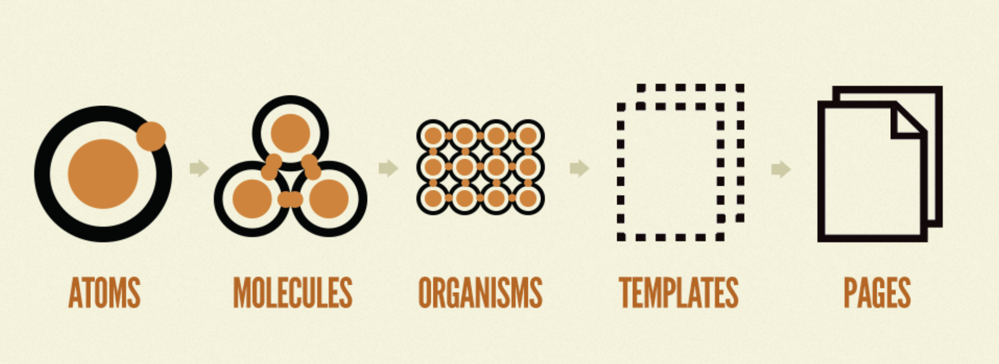
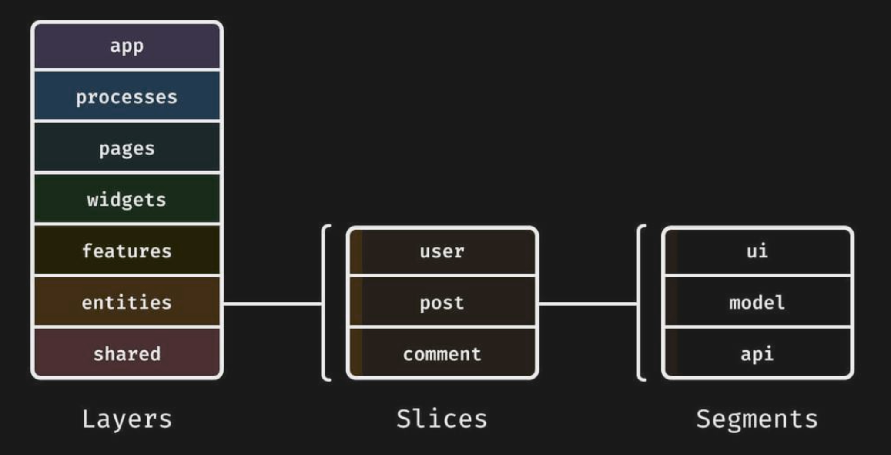

# Развертывание проекта

Развертывание проекта - один из важнейших этапов проектирования, который имеет ключевое значение для всего хода разработки. Проблемная конфигурация служит катализатором для появления многочисленных проблем на последующих стадиях работы специалистов. Не верные решения при развертывании могут повлечь за собой колоссальные трудозатраты со стороны разработчиков, а, напротив, верные решения могут существенно ускорить процесс работы, поэтому относиться к этому этапу следует максимально ответственно.

## Теоретический анализ

Прежде чем приступать к развертыванию проекта, необходимо провести тщательную теоретическую подготовку. Для этого следует ознакомиться с техническим заданием и проконсультироваться с аналитиком. Точки внимания при теоретическом анализе:

- Размер проекта
- Сложность проекта
- Наличие фич, которые требуют добавления в проект дополнительных технологий
- Требования к SEO
- Количество специалистов в команде

## Формирование стека технологий

Стек технологий должен включать в себя не более и не менее того, что необходимо для реализации задач проекта.

Избыточность технологий может привести к излишним трудозатратам со стороны разработчиков. Недостаточная же конфигурация также может привести к неожиданному появлению пулла работ, связанного с тем, что внедрение технологий в проект на поздних этапах разработки повлечет за собой изменения по всему проекту.

Теоретический анализ позволяет собрать факты, на которые следует опираться при создании технологического стека. Это позволит сделать стек максимально безопасным для дальнейших этапов разработки. Здесь некоторые рекомендации по формированию стека:

- В первую очередь нужно обратить внимание на количество интерактивных элементов со сложной логикой отображения и реактивности. В случае, если таких элементов много - требуется включить в стек React/Vue/Angular/etc. Если же большинство элементов в приложении тривиальны, использование фреймворков/библиотек, указанных выше, не требуется.
- Для проектов на React/Vue/Angular/etc чаще всего требуется наличие ui-кита. Для этого в стек обязательно добавляется storybook.
- Сразу после этого стоит обратить внимание на требования к SEO. Если в стеке уже есть React/Vue/Angular/etc, стоит рассмотреть использование SSR/SSG.
- Далее, в случае, если проект достаточно крупный, и в команде есть два и более разработчиков, следует добавить в проект typescript.
- Также, для крупных проектов имеет смысл рассмотреть использование монорепозитория. Если же над проектом работают несколько команд, и проект имеет сложный функционал - стоит рассмотреть использование микрофронтендов.
- Если на проекте используется React/Vue/Angular/etс, следует определиться с выбором инструмента для стилизации, стейтменеджера, роутинга.
- Для проектов на react существует create-react-app. Его использование, или отказ от него также следует рассмотреть.
- Для проектов на базе js в обязательном порядке следует рассмотреть добавление unit-тестов, линтеров, форматтеров, и прехуков для git.
- В случае, если на проекте используется только статика - стоит определиться будут ли подключаться дополнительные инструменты типа фреймвороков для разметки, инструментов стилизации, и тд. Если да - стоит добавить в стек webpack.
- Если реализация каких-либо фич проекта требует дополнительных инструментов - их обязательно стоит сразу добавить в стек.

## Построение архитектуры

Хорошая архитектура позволяет разработчикам избегать лишних референсов, путаницы в файлах, и спагетти-кода, а также успешно масштабировать проект.

Существуют готовые подходы к построению архитектуры, вот некоторые из них:

- atomic design: [https://bradfrost.com/blog/post/atomic-web-design/](https://bradfrost.com/blog/post/atomic-web-design/)
    

    
- feature sliced design: [https://feature-sliced.design/](https://feature-sliced.design/)
    

Приведенные архитектурные варианты имеют достаточно подробную документацию, поэтому изучить их не составит труда. Однако ни одна из этих архитектур не является в полной мере универсальной. Чтобы выявить подходит ли тот или иной архитектурный подход для конкретного проекта, требуется составить архитектурную модель, для этого можно воспользоваться UML. Моделирование позволяет более комплексно и детально продумать разработку проекта, увидеть все возможные референсы и найти вероятные проблемные места, а также выработать необходимую архитектуру для конкретного кейса.

Вот несколько советов для построения архитектуры приложения:

- Ограничивайте ответственность. Если сущность берет на себя слишком много - велик риск получить спагетти-код.
- Старайтесь организовывать стейтменеджемент относительно сервисов API. То есть если бэкенд предоставляет CRUD для работы с сущностью Users, значит в стейте на фронте также обязательно должна быть сущность для хранения и обработки данных типа Users.
- Старайтесь держать все, что касается конкретной сущности, в одном месте. К примеру, если у вас проект на redux, и есть несколько сущностей стейтменеджемента, и к каждой из них относится редьюсер, экшны, и контроллер в виде хука, то не следует создавать отдельные папки для редьюсеров, экшнов, и хуков. Лучше создать одну папку, именовать ее по названию сущности, и сложить все туда. Это существенно упростит взаимодействие разработчиков с проектом.
