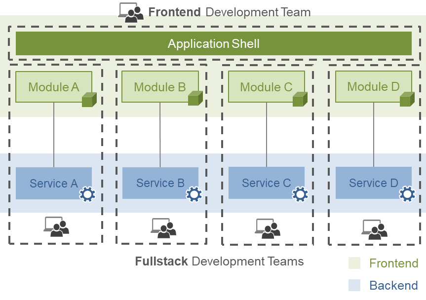

# Микрофронтенды и виджеты

Микросервисная архитектура подразумевает использование нескольких приложений, которые объединяются в одно единое.

## Преимущества микросервисной архитектуры:

- **Отказоустойчивость.** При отказе одного микросервиса остальные продолжают исправную работу, в то время как монолитное приложение при отказе теряет весь свой функционал.
- **Безопасность.** Чаще всего микросервисы независимы, и не имеют доступа к другим микросервисам. Это позволяет добиться безопасности как в плане отладки, так и в плане несанкционированного доступа к приложению.
- **Делегирование ответственности команд разработки.** Обычно, за один или несколько микросервисов отвечают отдельные команды. При отказе, вызванном ошибкой конкретной команды, ответственность распространяется только на конкретный микросервис.
- **Независимость от инструментов разработки.** При микросервисном подходе каждая команда вправе выбирать необходимый стек для выполнения поставленных задач.
- **Масштабируемость для больших проектов.** Разбиение на микросервисы позволяет каждой конкретной команде вести разработку с более высокой скоростью, не задумываясь об влиянии принятых решений на общее приложение.
- **Производительность.** При использовании монолитной архитектуры на больших проектах рано или поздно возникают проблемы с производительностью. Микросервисная архитектура обеспечивает высокую производительность для таких проектов.

## Недостатки микросервисной архитектуры:

- **Сложности с взаимодействием сервисов между собой.** Так как каждый функциональный элемент изолирован, требуется особая тщательность при построении между ними грамотной коммуникации. При увеличении количества микросервисов сложность взаимодействия растет.
- **Сложности с тестированием.** При тестировании приложения с микросервисной архитектурой необходимо отдельно тестировать каждый микросервис, и учитывать взаимодействие между ними.
- **Расход времени на взаимодействие микросервисов.** Вопрос взаимодействия микросервисов требует дополнительных, по отношению к разработке целевого функционала приложения, трудозатрат, и часто требует взаимодействие разных команд, что влечет за собой дополнительные расходы на обсуждение.

Основная сфера применения микросервисной архитектуры - бэкенд-приложения, однако с недавнего времени данный подход начал использоваться при разработке веб-приложений. При таком подходе в качестве микросервисов используются виджеты.

Чаще всего, микросервисы на фронтенде и бэкенде работают в паре, то есть конкретные микросервисы бэкенде используются в связке с микрофронтендами(фулстек команды разработки)

Основной нюанс такой интеграции состоит в большой разнице между средами, в которых работают приложения. Бэкенд-приложения работают в нативной среде ОС, что позволяет добиться полной независимости каждого микросервиса(не считая необходимые взаимодействися), в то время как SPA запускаются в рамках веб-страницы, и в конечном итоге приобретают вид единого приложения, что влечет за собой следующие нюансы:

- Каждый микросервис в конечном итоге обращается к единому DOM и CSSOM, что влечет за собой проблемы с независимостью микросервисов, что чревато проблемами с безопасностью.
- С увеличением микросервисов увеличивается нагрузка на веб-страницу, что влечет за собой проблемы с производительностью, которые становятся крайне серьезными при использовании SPA в качестве микрофронтендов.
- Увеличение размера бандлов. Каждый микрофронтенед использует один и тот же исходный код фреймворка, а так же несколько независимых мкрофронтендов могут использовать однии и те же библиотеки, которые будут продублированы в бандлах.

Можно сделать вывод, что использование микросервисной архитектуры в веб-приложениях не наследует такие преимущества, как производительность и безопасность.

Проблема безопасности решается с помощью изоляции DOM и СSSOM. В этом могут помочь следующие инстументы:

- Iframe. Наиболее комплексное решение для изоляции виджетов. Позволяет отделить DOM и CSSOM виджета от общего приложения. Однако, возникают колоссальные сложности с построением взаимодействий между виджетами. Также появляются проблемы с производительностью, так как iframe является ресурсозатратным инструментом.
- Shadow DOM. Также решает проблему изоляции, однако имеет ограничения с поддержкой старыми версиями браузеров, использовании с CSP, использовании с SSR.
- Договоренность между командами. Запрет использования мутаций глобального DOM решает проблему лишь частично, так как большую роль играет человеческий фактор, а также неожиданные мутации нативных элементов разработчиками подключаемых пакетов(monkey patching).

Резюмируя, можно вывести список кейсов, когда стоит использовать микрофронтенды:

1. У вас большое приложение.
2. Несколько команд разработки.
3. Существуют задачи, для решения которых требуется специфичные инструменты, или замена фреймворка
4. Вы все чаще сталкиваетесь с проблемами при выкате обновлений приложения.
5. Требования к производительности не имеют существенных ограничений
6. Узкая целевая аудитория приложения, которая ограничена в использовании инструментов для взаимодействия с приложением(корпоративные приложения)

На данный момент существует несколько инструментов по организации микрофронтендов:

- SingleSPA: [https://single-spa.js.org/](https://single-spa.js.org/)
- Webpack Module Federation: [https://webpack.js.org/concepts/module-federation/](https://webpack.js.org/concepts/module-federation/)
- Siteless: [https://www.npmjs.com/package/siteless](https://www.npmjs.com/package/siteless)

Самым универсальным является Module Federation. Список примеров использования: [https://github.com/module-federation/module-federation-examples](https://github.com/module-federation/module-federation-examples)
