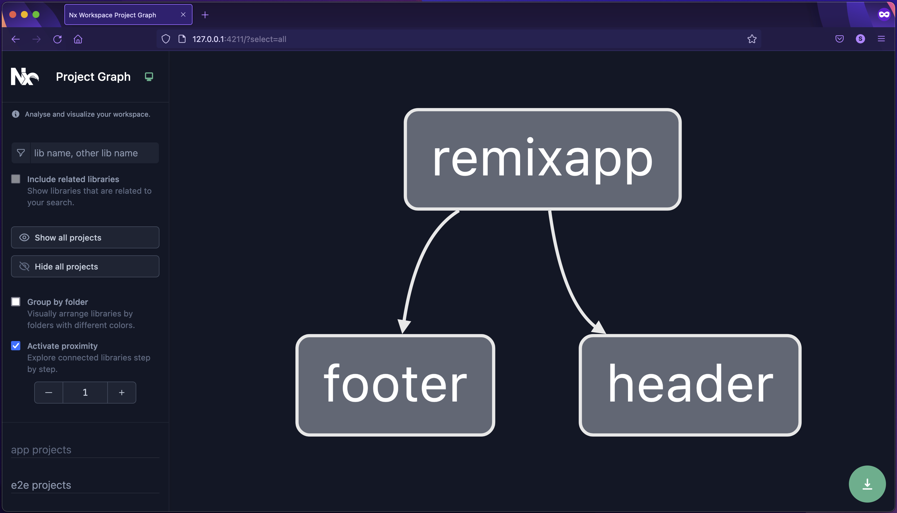

# Монорепозитории для фронтенда

Использование монорепозиториев подразумевает разбивку проекта на несколько приватных npm пакетов.

Преимущество данного подхода в первую очередь в инкапсуляции логики различных частей логики, и избежании построения опасных связей между сущностями проекта.

Например, при использовании архиетктурного подхода MVC выбор в пользу монорепозитория позволяет создать отдельные пакеты для моделей данных, моделей представления и контроллеров, при этом зависимостями удобно управлять и отслеживать потенциальные проблемы.

Также данный подход позволяет достаточно гибко отслеживать проблемы при длительной интеграции и доставке, так как сборка каждого пакета производится отдельно.

Недостаток состоит в сложности конфигурирования проектов, использующих монорепозиторий.

Для каждого абстрактного пакета требуется отдельная настройка сборки, конфигурация TypeScript, линтеров, код-форматтеров, unit-тестов и тд.

К примеру, в большинстве существующих IDE возникают проблемы с использованием нескольких конфигов линтера, используемых для разных пакетов, хранящихся в одном проекте.

Также следует учесть, что в сети существует достаточно мало данных о проблемах, связанных с этим подходом, поэтому следует тщательно изучить требования к проекту, прежде чем принимать решение о внедрении данного подхода.

## Для реализации монорепозитория используются следующие инструменты

- NPM/Yarn workspaces: дефолтный инструмент, все последующие инструменты являются производными от воркспейсов.
- Lerna: более гибкий и удобный инструмент для работы с воркспейсами. С недавнего времени находится в зоне ответственности NRWL, используется в NX. Есть достаточно подробная документация: [https://lerna.js.org/docs/getting-started](https://lerna.js.org/docs/getting-started)
- NX: Самое комплексное решение, позволяет использовать прессеты для настройки пакетов, и достаточно хорошо документирован: [https://nx.dev/getting-started/intro](https://nx.dev/getting-started/intro)

Рекомендуется использовать NX, так как он предоставляет гибкую систему развертывания, поддерживает большинство современных подходов(SSR, микрофронтенды). Есть поддержка миграции с различных инструментов. Имеются интеграции с системами CI/CD.

Встроенный инструмент кодогенерации позволяет быстро и безопасно организовать инфраструктуру проекта с помощью CLI команд.

## Инструкция по организации проекта на основе lerna

Первоначально рекомендуется установить расширения для работы с монорепозиториями в используемом редакторе кода

VSCode:

- [Nx Console VSCode Plugin](https://marketplace.visualstudio.com/items?itemName=nrwl.angular-console)

WebStorm:

- [nx-webstorm](https://plugins.jetbrains.com/plugin/15000-nx-webstorm)
- [Nx Console Idea](https://plugins.jetbrains.com/plugin/15101-nx-console-idea)

Развернуть проект на основе lerna можно с помощью команды npx lerna@latest init

При этом создается проект, который содержит в себе корневой package.json, который содержит необходимую конфигурацию для работы с пакетами lerna.

Также создается файл lerna.json, который содержит конфигурацию для работы библиотеки. Здесь можно указать какой пакетный менеджер будет использован. На данный момент lerna поддерживает NPM/YARN/PNPM.

Для добавления пакета рекомендуется использовать команду npx lerna crate {workspace-name}

Для удобного менеджемента пакетов рекомендуется именовать корневой пакет как @package-name, вложеные пакеты как @package-name/workspace-name

При развертывании проекта удобно использовать команду npx lerna bootstrap, которая устанавливает зависимости для всех вложеных пакетов

Для добавления зависимостей используется команда npx lerna add. По умолчанию зависимость будет установлена в каждый из существующих пакетов. Чтобы установить зависимость в конкретный пакет используется флаг —scope={workspace-name}. Также доступны флаги —dev, —peer и другие. Подробную документацию по команде можно прочитать здесь: [https://github.com/lerna/lerna/tree/main/commands/add](https://github.com/lerna/lerna/tree/main/commands/add)

Для запуска скриптов используется команда npx lerna run. По умолчанию скрипт будет запущен для каждого из существующих пакетов. Чтобы запустить скрипт для конкретного пакета требуется добавить флаг —scope={workspace-name}. Для запуска скриптов в параллельном режиме используется флаг —parallel.

Для публикации удобно пользоваться встроеным инструментом, подробнее здесь: [https://github.com/lerna/lerna/tree/main/commands/publish](https://github.com/lerna/lerna/tree/main/commands/publish)

Также lerna, будучи частью функционала NX, gозволяет визуализировать дерево пакетов. Для этого требуется запустить команду npx nx graph

## Пример визуализациии

Пример проекта на основе lerna можно посмотреть тут: [https://github.com/lerna/getting-started-example.git](https://github.com/lerna/getting-started-example.git)

## Инструкция по организации проекта на основе NX

Для интеграции с редакторами кода рекомендуется использовать следующие инструменты:

VSCode:

- [Nx Console VSCode Plugin](https://marketplace.visualstudio.com/items?itemName=nrwl.angular-console)

WebStorm:

- [nx-webstorm](https://plugins.jetbrains.com/plugin/15000-nx-webstorm)
- [Nx Console Idea](https://plugins.jetbrains.com/plugin/15101-nx-console-idea)

Для развертывания проекта используется команда: npx create-nx-workspace@latest package-based --preset=npm

Также для развертывания доступны другие прессеты.

Пакты в nx создаются вручную в папке packages

Для запуска скриптов используется следующая команда: npx nx {script-name} {workspace-name}.

Для запуска скрипта для каждого из существующих пакетов существует команда npx nx run-many --target={script-name}

Также в NX есть кеширование результатов выполнения скриптов, подробнее здесь: [https://nx.dev/core-features/cache-task-results](https://nx.dev/core-features/cache-task-results)

Для визуализации графа пакетов, по аналогии с lerna, используется команда npx nx graph

Для построения архитектуры микрофронтендов в NX существует интеграция с module federation: [https://nx.dev/recipes/module-federation/faster-builds](https://nx.dev/recipes/module-federation/faster-builds)

В целом, если стоит задача по развертыванию микрофронтендов на проекте, предпочтительнее использовать NX
