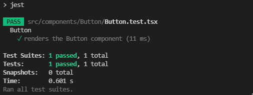

# Проектирование UI-Kit

UI-Kit - это набор общих атомарных компонентов, которые используются для построения UI интерфейсов. Проще говоря, это набор компонентов(кнопка, инпут, дропдаун и тд), которые имеют максимально гибкую сигнатуру, и способны сократить трудозатраты разработчика на построение экранов веб-приложения.

Спроектировать UI-Kit можно двумя способами:

- Интегрировать внутрь компонентной базы проекта, т.е. просто создать отдельную директорию с компонентами и при необходимости обращаться к ней для импорта необходимых элементов. Такой подход рекомендуется использовать в случаях, когда проект не является [монорепозиторием](/roadmap/middle/architecture/monorepo), а также когда UI-Kit не требуется переиспользовать в других приложениях.
- Организовать npm пакет с набором компонентов. Этот способ сложнее предыдущего, но отлично подходит во всех остальных случаях.

Проектирование UI-Kit, интегрированного в компонентную базу проекта, не представляет сложности, в то время как организация npm пакета требует от специалиста определенных навыков в конфигурировании webpack, typescript, а также в подключении тестов, линтеров, и тд. Фактически такой пакет является отдельным проектом, который требует полной настройки, которая отличается от стандартной конфигурации проектов на react.

## Настройка внешнего UI-Kit

Сперва инициализируем проект командой:

```bash
npm init
```

Затем, установим в проект typescript и типы для работы с react:

```bash
npm install react --save-peer
```

```bash
npm install typescript @types/react --save-dev
```

Далее создадим структуру файлов. Должно получиться примерно следующее:

```markdown
.
├── src
│   ├── components
|   │   ├── Button
|   |   │   ├── Button.tsx
|   |   │   └── index.ts
|   │   └── index.ts
│   └── index.ts
├── package.json
└── package-lock.json
```

После этого добавим typescript командой 

```bash
npx tsc --init
```

Будет сгенерирован файл tsconfig.json, заполненный комментариями с описанием параметров, нам понадобятся примерно следующие:

```json
{
    "compilerOptions": {
         "target": "es5",
         "esModuleInterop": true,
         "forceConsistentCasingInFileNames": true,
         "strict": true,
         "skipLibCheck": true,
         "jsx": "react",
         "module": "ESNext",
         "declaration": true,
         "declarationDir": "types",
         "sourceMap": true,
         "outDir": "dist",
         "moduleResolution": "node",
         "allowSyntheticDefaultImports": true,
         "emitDeclarationOnly": true,
    }
}
```

В качестве сборщика будем использовать роллап, так как он лучше всего подходит для настройки подобных библиотек. Установим необходимые зависимости:

```bash
npm install rollup @rollup/plugin-node-resolve @rollup/plugin-typescript @rollup/plugin-commonjs rollup-plugin-dts rollup-plugin-postcss rollup-plugin-peer-deps-external rollup-plugin-terser @testing-library/react jest @types/jest @babel/core @babel/preset-env @babel/preset-react @babel/preset-typescript babel-jest identity-obj-proxy --save-dev
```

После этого создадим файл конфиг rollup.config.js со следующим содержимым:

```js
import resolve from "@rollup/plugin-node-resolve";
import commonjs from "@rollup/plugin-commonjs";
import typescript from "@rollup/plugin-typescript";
import dts from "rollup-plugin-dts";
import postcss from "rollup-plugin-postcss";
import { terser } from "rollup-plugin-terser";
import peerDepsExternal from 'rollup-plugin-peer-deps-external';

const packageJson = require("./package.json");

export default [
  {
    input: "src/index.ts",
    output: [
      {
        file: packageJson.main,
        format: "cjs",
        sourcemap: true,
      },
      {
        file: packageJson.module,
        format: "esm",
        sourcemap: true,
      },
    ],
    plugins: [
	  peerDepsExternal(),
      resolve(),
      commonjs(),
      typescript({ tsconfig: "./tsconfig.json" }),
	  postcss(),
	  terser(),
    ],
  },
  {
    input: "dist/esm/types/index.d.ts",
    output: [{ file: "dist/index.d.ts", format: "esm" }],
    plugins: [dts()],
	external: [/\.css$/],
  },
];
```

Для тестов создадим файл jest.config.js со следующим содержимым:

```js
module.exports = {
  testEnvironment: "jsdom",
  moduleNameMapper: {
    ".(css|less|scss)$": "identity-obj-proxy",
  },
};
```

После чего добавим конфиг для babel, файл babel.config.js:

```js
module.exports = {
  presets: [
    "@babel/preset-env",
    "@babel/preset-react",
    "@babel/preset-typescript",
  ],
};
```

Далее просто добавим в секцию скриптов команды для тестирования и сборки:

```json
{
  "scripts": {
    "rollup": "rollup -c",
    "test": "jest"
  }
}
```

Теперь мы можем проверить работоспособность тестов. Для этого добавим файл src/components/Button/Button.test.tsx со следующим содержимым:

```jsx
import React from "react";
import { render } from "@testing-library/react";

import Button from "./Button";

describe("Button", () => {
  test("renders the Button component", () => {
    render(<Button label="Hello world!" />);
  });
});
```

И запустим команду npm run test. Результат должен быть примерно следующим:



Теперь проверим сборку командой npm run rollup. После сборки в проекте должна появиться папка dist.

## Настройка storybook

Этот пункт универсален для любого типа UI-Kit.

Storybook - это инструмент для визуализации компонентов пользовательского интерфейса вне вашего сайта/приложения. Он отлично подходит для создания прототипов и тестирования различных визуальных состояний компонентов, чтобы убедиться, что они работают так, как задумано, без дополнительных накладных расходов, связанных с наличием на экране других ненужных компонентов.

Для его автоматической установки и настройки необходимо выполнить следующую команду: 

```bash
npx sb init --builder webpack5
```

*Обратите внимание, что на момент написания этой статьи Storybook все еще по умолчанию использует webpack 4, поэтому мы добавили дополнительный флаг builder. Предположительно, скоро по умолчанию будет использоваться 5, так что в будущем это может оказаться ненужным*

После этого можно начать использовать сторибук в проекте. Создадим файл src/components/Button/Button.stories.tsx, и добавим в него следующий код:

```tsx
import React from "react";
import { ComponentStory, ComponentMeta } from "@storybook/react";
import Button from "./Button";

export default {
  title: "ReactComponentLibrary/Button",
  component: Button,
} as ComponentMeta<typeof Button>;

const Template: ComponentStory<typeof Button> = (args) => <Button {...args} />;

export const HelloWorld = Template.bind({});
HelloWorld.args = {
  label: "Hello world!",
};

export const ClickMe = Template.bind({});
ClickMe.args = {
  label: "Click me!",
};
```

Далее запускаем сторибук командой npm run storybook.

**Примечание:** Возможно, вы столкнетесь с ошибками из-за отсутствия зависимостей. В этом случае есть несколько решений.

Первое - установить эти зависимости вручную. Например, `react-dom`. Это не идеальный вариант, поскольку ваш проект сам по себе не должен зависеть от этих библиотек, поэтому нет необходимости включать их, поскольку они включены в состав зависимостей Storybook.

Если вы просто выполните свежую команду `npm install`, она установит все `peerDependencies` используемых вами библиотек. Перед выполнением этой команды вам может понадобиться удалить директории `package-lock.json` и `node_modules`. Они будут восстановлены автоматически после новой установки.

Также стоит обратить внимание на то, что хотя проект уже поддерживает scss, для тестирования компонентов в storybook нужно добавить дополнительные зависимости и конфигурацию. Добавим зависимости командой: `npm install @storybook/preset-scss css-loader sass sass-loader style-loader --save-dev`

Далее модифицируем файл .storybook/main.js:

```js
module.exports = {
  "stories": [
    "../src/**/*.stories.mdx",
    "../src/**/*.stories.@(js|jsx|ts|tsx)"
  ],
  "addons": [
    "@storybook/addon-links",
    "@storybook/addon-essentials",
    "@storybook/preset-scss"
  ],
  "core": {
    "builder": "webpack5"
  }
}
```

На этом настройку UI-Kit можно считать завершенной.
